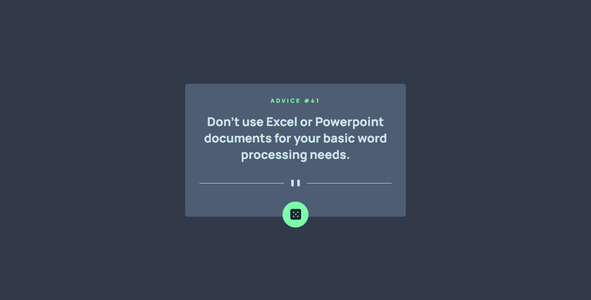

# Frontend Mentor - Advice generator app solution

This is a solution to the [Advice generator app challenge on Frontend Mentor](https://www.frontendmentor.io/challenges/advice-generator-app-QdUG-13db). Frontend Mentor challenges help you improve your coding skills by building realistic projects.

## Table of contents

- [Overview](#overview)
  - [The challenge](#the-challenge)
  - [Screenshot](#screenshot)
  - [Links](#links)
- [My process](#my-process)
  - [Built with](#built-with)
  - [What I learned](#what-i-learned)
- [Author](#author)

## Overview

### The challenge

Users should be able to:

- View the optimal layout for the app depending on their device's screen size
- See hover states for all interactive elements on the page
- Generate a new piece of advice by clicking the dice icon

### Screenshot

### Links

- Solution URL: [https://github.com/coderSuresh/advice-generator-app-main](https://github.com/coderSuresh/advice-generator-app-main)
- Live Site URL: [https://codersuresh.github.io/advice-generator-app-main](https://codersuresh.github.io/advice-generator-app-main)

## My process

- Download the starter code
- Set up the project with github
- Read the README.md file and have a look around the project/design
- Get colors, fonts etc from the style-guide.md file
- Set up project on VS Code
- Start coding.
- Test different screen size and push final code to Github

### Built with

- HTML
- CSS 
- SCSS
- JavaScript

### What I learned

By solving this challenge, I learned to fetch data from third party API and display it on website. I used Fetch API to fetch data from the API.

## Author

- Website - [Coder Suresh](https://codersuresh.github.io)
- Frontend Mentor - [@codersuresh](https://www.frontendmentor.io/profile/codersuresh)
- Twitter - [@codersuresh](https://www.twitter.com/codersuresh)